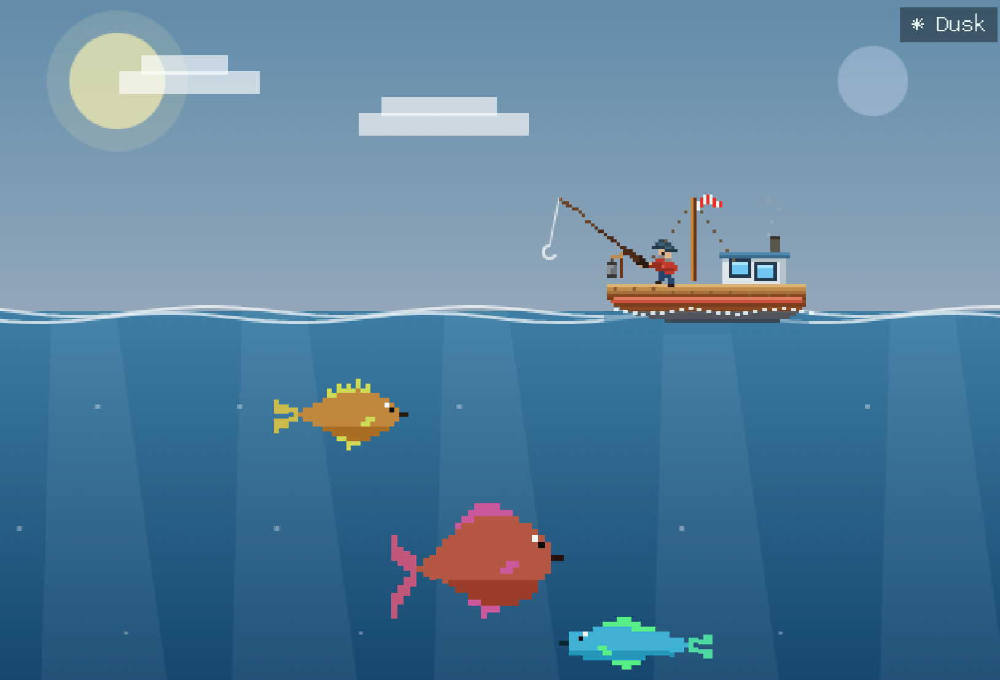

# Fish, huh

A 2D pixel fishing game that runs in your browser. 155 species across eight
waters, from a freshwater lake down to a sunken wreck in the abyss. Every sprite,
every wave and every cloud is drawn in code — there is not a single image file in
this repository.



```
npm install
npm run dev
```

Open the printed URL. That's the whole setup.

---

## What it is

You cast, you wait, you fight something. The fight is a vertical gauge: hold to
raise a catch zone, keep it over the fish, fill the meter before the fish drains
it. Simple to describe, and then it gets complicated, because holding the button
forever will snap your line.

**The fight has three ways to end.** You land it, it escapes, or you over-reel
and the line goes. A tension bar fills while you reel and recovers when you ease
off — a player who never releases snaps the line essentially every time, and a
player who eases at the warning almost never does. Fish also tire: the marker
slows as you win, so fights open frantic and close controlled.

**Casting skill and spook mechanics.** Hold to charge your cast power meter. Landing in the sweet spot (70–85%) performs a clean, silent cast. Missing the sweet spot creates a splash radius that spooks nearby fish, causing them to flee.

**Species fight differently.** Five styles, assigned from each fish's own stats:
runners sprint end to end, sounders dive for the bottom, huggers cling low,
darters twitch constantly, and the rest hold steady. Multi-phase boss fish add escalating tension and changing fight patterns.

**Fish behave differently in the water, too.** Small common species swim in
shoals that follow a leader. Big predators hunt smaller swimmers and eat them —
if one takes the fish you were luring, it's gone. Flat-bodied species hug the
seabed and ignore a shallow cast.

**Environment, tides, and weather gate the roster.** Legendaries prefer the dark,
shoals feed by day, predators surge in storms, anglerfish come out at night.
Tides and moon phases dynamically shift species spawn rates.

---

## Zones

| Zone | Unlock | Notes |
|---|---|---|
| Freshwater Lake | free | |
| Mountain River | 100 | |
| Brackish Estuary | 250 | |
| Saltwater Coast | 600 | |
| Coral Reef | 1,000 | swaying coral |
| Frozen Fjord | 1,400 | snow, blizzards, drifting ice floes |
| Deep Sea Abyss | 2,000 | no boat — you pilot a submersible |
| Sunken Wreck | 3,200 | a ship on the seabed with lit portholes |

The two deep zones drop the surface view entirely: no sky, no boat. You descend
in a submersible with a headlight, through marine snow and bioluminescence.

---

## Progression

- **Tackle shop** — rod, line and bait upgrades that change the fight, not just numbers
- **Salvage crates** — three tiers, weighted rolls, duplicates melt into coins
- **Hall of Fame** — 25 sea relics across six rarities up to mythic, each granting a permanent passive; complete a rarity tier for a set bonus
- **Aquarium** — park caught species in six tanks for passive income while you're away
- **Bait bench** — junk catches yield scrap; craft baits that target a specific class of fish
- **Daily quests & Contests** — three quests per day seeded from the date, plus Sprint Contest events
- **Voyages** — prestige reset for a permanent stacking coin multiplier; keeps your Fishdex, relics and aquarium
- **Shipyard** — hulls, flags and lanterns for your boat, purely cosmetic
- **Trophy wall, Fishdex, achievements, stats, catch cards** — collection screens & exportable catch cards
- **PWA & Accessibility** — offline PWA support, chiptune music & soundscapes, colorblind mode toggle
- Junk, treasure, shiny variants, catch streaks

---

## Everything is drawn in code

No sprite sheets, no asset pipeline, no image files.

Fish are ragged character grids rendered pixel by pixel, with belly shading and a
tail that shears as they swim. The boat, angler and rod are pure `fillRect` pixel
art — the rod is a bezier that visibly bends under load, and the boat rocks by
per-column vertical shear rather than canvas rotation, because rotating a pixel
sprite makes it shimmer.

Sky, water, clouds, rain, snow and light shafts all quantize to a 4px grid, so
the background matches the sprites instead of looking airbrushed.

Sound is a dependency-free Web Audio engine: filtered noise bursts for splashes,
oscillator envelopes for everything else.

---

## Procedural fish (optional)

52 of the species are generated by [FishGen](#), a companion service that
produces pixel fish from seeds. Two packs are committed:

- **Pack 1** (`genfish-pack.json`) — 24 fish across fresh, salt, brackish and deepsea
- **Pack 2** (`genfish-pack2.json`) — 28 fish filling the four zones the first pack couldn't reach: river, reef, ice and wreck

Sprites and stats are baked in, so the game has **no runtime dependency** on
FishGen — the service only needs to run if you want to regenerate the packs.

---

## Development

```
npm run dev      # vite dev server, hot reload
npm run build    # production build to dist/
```

There is no test framework. Verification is a headless probe that validates every
species, sprite, quest, relic, crate and economy constant:

```bash
node --import ./probe-loader.mjs probe.mjs
```

`probe-loader.mjs` exists because Vite allows bare JSON imports and Node requires
an import attribute. Run probes through it.

`preview-vessel.mjs` renders the boat, angler and rod to a PNG with a hand-rolled
encoder, so the pixel art can be reviewed without launching the game.

### Layout

```
src/
  App.jsx              game shell: save, HUD, all panels
  scene/Scene.jsx      canvas render loop + cast/fight state machine
  scene/vessel.js      pixel-art boat, angler, bending rod
  pixel/sprites.js     char-grid templates + drawFish
  data/                fish, zones, relics, crates, bait, aquarium, quests, prestige
  audio/sfx.js         Web Audio sound engine
```

Save data lives in `localStorage` and migrates forward automatically from older
versions.

---

## License

MIT
